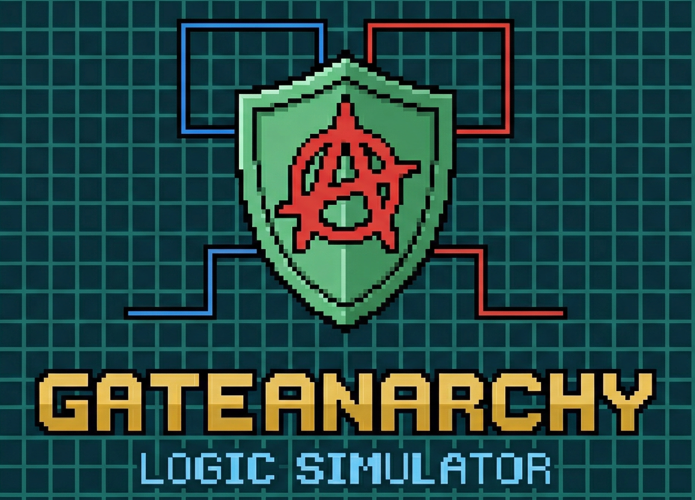

# Logic Simulator

A professional, interactive web-based logic circuit simulator built with React and Vite. Design, visualize, and simulate digital logic circuits with real-time signal propagation and intuitive controls.

## Features

- **Interactive Circuit Design** - Create and manage digital logic circuits with drag-and-drop node placement
- **Comprehensive Gate Support** - AND, OR, NOT gates with configurable inputs and outputs
- **Real-time Simulation** - Instant signal propagation through circuits with visual feedback
- **Multi-pin Connections** - Intelligent bidirectional wiring with waypoint support and validation
- **Input/Output Components** - Switches for input control and LEDs for output visualization with color states
- **Clock Signal Generator** - Configurable clock signals for sequential circuit testing
- **Undo/Redo System** - Full history tracking for all circuit modifications
- **Region Management** - Group and organize nodes into labeled regions for circuit abstraction
- **Custom Components** - Create reusable composite circuits from existing designs
- **Performance Optimization** - Level of Detail rendering for smooth experience with large circuits
- **Viewport Culling** - Intelligent rendering optimization based on visible area
- **Rich Settings** - Customizable appearance, grid snapping, wire styles, and zoom preferences
- **Keyboard Shortcuts** - W for auto-wire, Q for quick-connect mode, Shift+Click for sequential connections
- **Multi-select** - Ctrl+Click to select multiple nodes and manage them together
- **Truth Table Analysis** - Generate and view truth tables for circuit outputs
- **LED Decimal Display** - Visual grouping of LEDs to display decimal values

## Getting Started

### Prerequisites

- Node.js 16 or higher
- npm or yarn package manager

### Installation

```bash
# Clone the repository
git clone https://github.com/Divakar-26/GateAnarchy
cd GateAnarchy

# Install dependencies
npm install
```

### Development

Start the development server with hot module replacement:

```bash
npm run dev
```

The application will be available at `http://localhost:5173`

### Building

Create an optimized production build:

```bash
npm run build
```

Output files are generated in the `dist/` directory.

## Usage

### Creating Circuits

1. Select a component type from the toolbar (Switch, LED, AND, OR, NOT, Clock)
2. Click on the canvas to place components
3. Use drag to reposition components
4. Hold Shift+Drag to pan the viewport

### Connecting Components

- **Click and drag** from a pin to create a wire connection
- **Add waypoints** by clicking during wire drawing to create custom paths
- **Delete waypoints** with the Delete key while drawing
- **Shift+Click** on pins for fast sequential connections
- **W key** to auto-wire selected nodes (switches → circuits → LEDs)
- **Q key** to toggle quick-connect mode for rapid connections
- **Right-click** on wires to delete them

### Selection and Manipulation

- **Click** on a node to select it
- **Ctrl+Click** to add/remove nodes from selection
- **Ctrl+Drag** to select multiple nodes within a box
- **Delete** key to remove selected nodes
- Drag selected nodes to move them together

### Configuration

- **1-2-3 keys** toggle Switch, LED, and Clock states
- **Settings panel** (gear icon) for appearance, rendering, and behavior options
- **Grid snapping** toggleable in settings
- **Level of Detail** rendering for optimized performance during zoom
- **Wire style** selection (Bezier curves or straight lines)

### Advanced Features

- **Region creation** - Select nodes and press R to create a labeled region
- **Custom components** - Convert regions to reusable composite circuits
- **Auto-wire intelligent** - Connects to available pins only, respecting existing connections
- **Decimal LED display** - Group LEDs to visualize binary-to-decimal conversion

## Keyboard Shortcuts

| Key | Action |
|-----|--------|
| W | Auto-wire selected nodes |
| Q | Toggle quick-connect mode |
| R | Create new region |
| C | Copy selected nodes |
| V | Paste nodes |
| Delete/Backspace | Delete selected nodes or active wire waypoints |
| Shift+Click | Quick sequential connections |
| Ctrl+Click | Multi-select nodes |
| Space | Pan mode (hold and drag) |
| +/- | Zoom in/out |
| Shift+Z | Fit all nodes in viewport |

## Architecture

### Core Components

- **Workspace** - Main canvas and circuit management
- **Node** - Logic gate, switch, LED, and clock representations with LOD rendering
- **Wire** - Connection rendering with multi-layer glow effects
- **Pin** - Input/output pin handling and interaction

### Utilities

- **propagate.js** - Signal propagation engine
- **pinPosition.js** - Pin coordinate calculations
- **nodeSize.js** - Dynamic node dimension computation
- **viewportCulling.js** - Viewport optimization
- **clockManager.js** - Clock signal management

### Configuration

- **gates.js** - Gate definitions and configurations
- **customComponents.js** - User-created composite circuit storage
- **SettingsContext.js** - Application settings management

## Performance

The simulator implements several optimization strategies:

- **Level of Detail (LOD)** - Simplified rendering for zoomed-out nodes
- **Viewport Culling** - Only renders visible components based on camera position
- **Memoization** - Cached calculations for region bounds and node colors
- **React Memo** - Component memoization to prevent unnecessary re-renders
- **Wire Visibility** - Efficient wire culling based on connected nodes

## Browser Compatibility

- Chrome/Edge 90+
- Firefox 88+
- Safari 14+
- Modern browsers with ES6 support

## Project Structure

```
logic-sim/
├── src/
│   ├── components/
│   │   ├── Node.jsx
│   │   ├── Pin.jsx
│   │   ├── Wire.jsx
│   │   ├── Workspace/
│   │   │   ├── Workspace.jsx
│   │   │   ├── SettingsPanel.jsx
│   │   │   ├── TruthTablePanel.jsx
│   │   │   └── propagate.js
│   │   └── Sidebar/
│   │       └── Sidebar.jsx
│   ├── configs/
│   │   ├── gates.js
│   │   ├── customComponents.js
│   │   └── SettingsContext.js
│   ├── utils/
│   │   ├── pinPosition.js
│   │   ├── nodeSize.js
│   │   ├── clockManager.js
│   │   └── viewportCulling.js
│   ├── hooks/
│   │   └── useHistoryState.js
│   └── styles/
├── public/
│   └── logo.png
└── package.json
```

## Contributing

Contributions are welcome. Please ensure:

- Code follows existing style conventions
- Changes maintain backward compatibility
- Performance optimizations are tested with large circuits
- New features include appropriate keyboard shortcuts

## License

This project is open source and available under the MIT License.

## Acknowledgments

- Built with React and Vite for optimal performance
- Circuit visualization inspired by professional CAD tools
- Signal propagation algorithm based on breadth-first graph traversal
